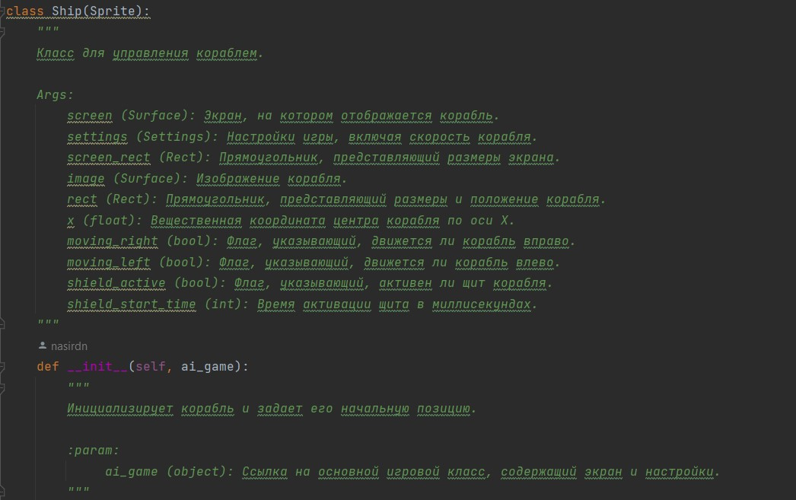
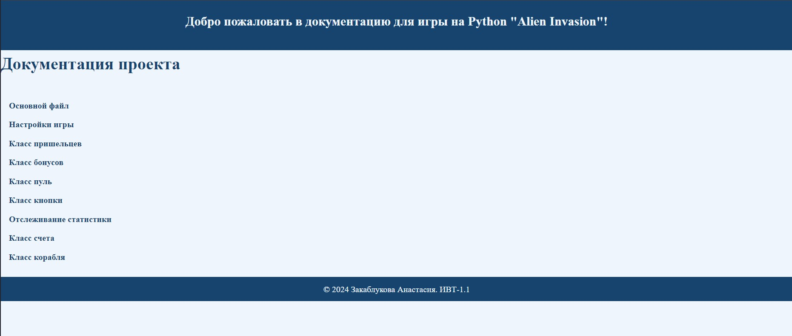
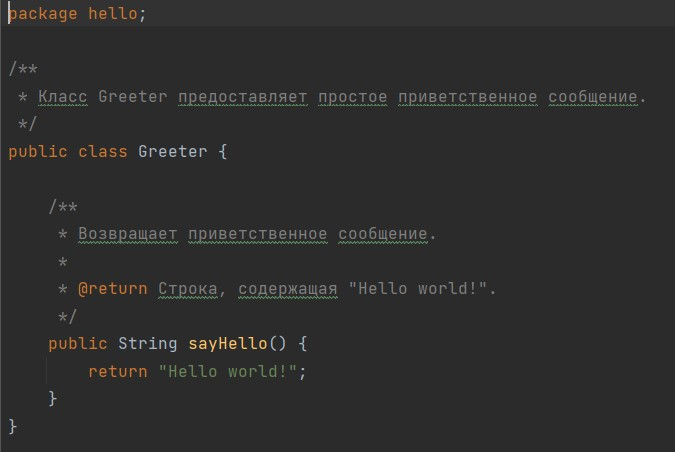
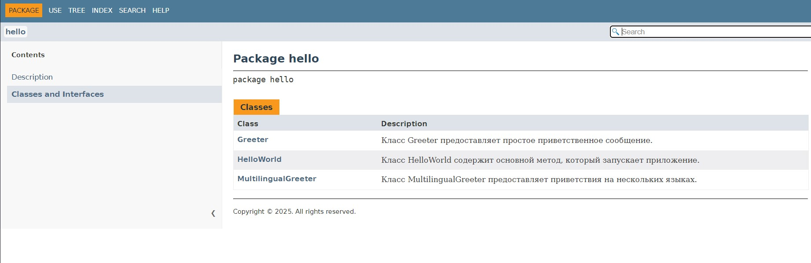

# Закаблукова Анастасия, ИВТ-1.1
# Лабораторная работа 4
Цели работы:
- Научиться документировать код на Python и Java с использованием стандартных инструментов.
- Освоить генерацию статической документации в формате HTML.
- Изучить процесс публикации документации на GitHub Pages.

### Часть 1. Python и Pydoc
В качестве проекта была выбрана игра Alien Invasion, которая была разработана в практических работах №2 и №3 на дисциплине "Математические основы компьютерной графики".  
[Проект на Python](py_alien)

Пример добавленных docstring-комментариев:  

Скриншот сайта с документацией:  

Трудностей в ходе работы с Pydoc не возникло.

### Часть 2. Java и Javadoc/Maven
В качестве проекта был склонирован простой проект с GitHub и доработан.  
[Проект на Java](java_project)

Пример добавленных docstring-комментариев:  

Скриншот сайта с документацией:  

Трудностей в ходе работы с Maven не возникло.